# Laravel Developer's Master Guide to Modern ASP.NET Core (.NET 8/9/10)

> **লক্ষ্য**: ১৫-২০ দিনের মধ্যে একজন সিনিয়র Laravel ব্যাকএন্ড ইঞ্জিনিয়ারকে আধুনিক ASP.NET Core Web API ও Clean Architecture-এ সম্পূর্ণ প্রোডাকশন-রেডি দক্ষতায় পৌঁছে দেওয়া।

---

# সূচিপত্র (Table of Contents)
1. [রিকোয়েস্ট লাইফসাইকেল: Laravel vs .NET (ধাপে ধাপে ফ্লো)](#1-রিকোয়েস্ট-লাইফসাইকেল-laravel-vs-net)
2. [উদাহরণ ১: Login Request-এর সম্পূর্ণ যাত্রা](#2-উদাহরণ-১-login-request-এর-সম্পূর্ণ-যাত্রা)
3. [উদাহরণ ২: Order Create (CQRS + Validation + DB + Queue)](#3-উদাহরণ-২-order-create-এর-সম্পূর্ণ-যাত্রা)
4. [কোথায় কী লিখবো? (ফোল্ডার ও লেয়ারের দায়িত্ব)](#4-কোথায়-কী-লিখবো-ফোল্ডার-ও-লেয়ারের-দায়িত্ব)
5. [নতুন যেকোনো ফিচার বানানোর ৫-ধাপের রেসিপি](#5-নতুন-যেকোনো-ফিচার-বানানোর-৫-ধাপের-রেসিপি)
6. [লোকাল বনাম প্রোডাকশন রানটাইম (PHP-FPM vs Kestrel)](#6-লোকাল-বনাম-প্রোডাকশন-রানটাইম)
7. [১৫-দিনের ফাস্ট-ট্র্যাক মাস্টারি রোডম্যাপ](#7-১৫-দিনের-ফাস্ট-ট্র্যাক-মাস্টারি-রোডম্যাপ)

---

## 1. রিকোয়েস্ট লাইফসাইকেল: Laravel vs .NET

Laravel এবং ASP.NET Core-এর ফান্ডামেন্টাল আর্কিটেকচার খুব কাছাকাছি, কিন্তু এক্সিকিউশন মডেলে একটি বিশাল পার্থক্য আছে:
* **Laravel (Process per Request)**: প্রতি রিকোয়েস্টে Nginx থেকে PHP-FPM নতুন প্রসেস বানায়, মেমোরিতে সব ফাইল বুটস্ট্র্যাপ করে, ডাটাবেজ থেকে ডাটা এনে রেসপন্স দিয়ে পুরো প্রসেস মেমোরি খালি (Garbage Collect) করে দেয়।
* **.NET (In-Memory Async Web Server)**: Kestrel ওয়েব সার্ভার সবসময় মেমোরিতে রানিং থাকে। রিকোয়েস্ট এলে কোনো ফাইল নতুন করে লোড হয় না; একটি লাইটওয়েট থ্রেড বা Async Task মেমোরি থেকেই মাইক্রোসেকেন্ডে রিকোয়েস্ট প্রসেস করে।

```mermaid
flowchart TD
    subgraph Laravel_Lifecycle["Laravel Request Lifecycle"]
        L1["1. HTTP Request (Nginx)"] --> L2["2. public/index.php"]
        L2 --> L3["3. bootstrap/app.php & Service Providers"]
        L3 --> L4["4. Global Middleware"]
        L4 --> L5["5. Route Dispatcher (routes/api.php)"]
        L5 --> L6["6. FormRequest (Validation rules)"]
        L6 --> L7["7. Controller Action"]
        L7 --> L8["8. Service / Eloquent Model (Active Record)"]
        L8 --> L9["9. Database (PDO)"]
        L9 --> L10["10. JsonResource -> JSON Response"]
    end

    subgraph DotNet_Lifecycle["ASP.NET Core Clean Architecture Lifecycle"]
        D1["1. HTTP Request (Kestrel)"] --> D2["2. Program.cs (Pre-compiled Host)"]
        D2 --> D3["3. ExceptionHandlingMiddleware"]
        D3 --> D4["4. Serilog / Authentication Middleware"]
        D4 --> D5["5. Controller Endpoint ([ApiController])"]
        D5 --> D6["6. MediatR ValidationBehavior (FluentValidation)"]
        D6 --> D7["7. CQRS Handler (Application Layer)"]
        D7 --> D8["8. Domain Entity & EF Core DbContext"]
        D8 --> D9["9. PostgreSQL (Npgsql) / Redis"]
        D9 --> D10["10. DTO -> RFC 7807 JSON Response"]
    end
```



---

## 2. উদাহরণ ১: Login Request-এর সম্পূর্ণ যাত্রা

ধরি ক্লায়েন্ট কল করল: `POST http://localhost:5000/api/auth/login`
```json
{
  "email": "alex.engineer@enterprise.com",
  "password": "SecretPassword123!"
}
```

### ধাপে ধাপে কী ঘটে:
1. **Kestrel Server (HTTP Listener)**:
   * রিকোয়েস্ট পোর্ট `5000`-এ প্রবেশ করে।
2. **Program.cs Middleware Pipeline**:
   * `ExceptionHandlingMiddleware`: রিকোয়েস্টকে `try-catch`-এর ভেতরে মুড়ে দেয়। কোনো এরর হলে স্বয়ংক্রিয়ভাবে ক্যাচ করবে।
   * `app.UseSerilogRequestLogging()`: রিকোয়েস্টের মেথড, পাথ ও ক্লায়েন্ট আইপি লগ করে।
   * `app.UseAuthentication()` এবং `app.UseAuthorization()`: চেক করে এই এন্ডপয়েন্টে `[AllowAnonymous]` আছে কি না। যেহেতু Login-এ `[AllowAnonymous]` আছে, তাই অনুমতি দিয়ে পরবর্তী ধাপে পাঠায়।
3. **Controller Routing ([ApiController])**:
   * রুট ম্যাচ করে: `[Route("api/[controller]")]` $\rightarrow$ `api/auth` এবং `[HttpPost("login")]` $\rightarrow$ [AuthController.cs](file:///c:/Users/sakhawat/dotnet/learning_code/src/OrderPulse.Api/Controllers/AuthController.cs).
   * **Model Binding**: JSON বডি স্বয়ংক্রিয়ভাবে `LoginRequest` C# ক্লাসে কনভার্ট হয়। (Laravel-এর `$request->validate()` বা `$request->all()`-এর মতো)।
4. **Token Generation (Infrastructure Layer)**:
   * কন্ট্রোলার `IJwtTokenGenerator`-কে কল করে।
   * [JwtTokenGenerator.cs](file:///c:/Users/sakhawat/dotnet/learning_code/src/OrderPulse.Infrastructure/Identity/JwtTokenGenerator.cs)-এ সিমেট্রিক কি (SymmetricSecurityKey) দিয়ে HMAC-SHA256 অ্যালগরিদমে সাইন করে JWT স্ট্রিং ও রিফ্রেশ টোকেন তৈরি করে।
5. **Response Return (JSON Formatting)**:
   * `return Ok(new AuthResponse(...))` কল হলে ASP.NET Core স্ট্যাটাস `200 OK` সহ JSON রিটার্ন করে।
   * Swagger UI বা Postman এই রেসপন্স দেখতে পায়।

---

## 3. উদাহরণ ২: Order Create-এর সম্পূর্ণ যাত্রা (CQRS + Validation + Unit of Work + Async Job)

ধরি অথেনটিকেটেড ইউজার রিকোয়েস্ট পাঠাল: `POST /api/orders`
```json
{
  "customerId": "11111111-1111-1111-1111-111111111111",
  "street": "123 Main St",
  "city": "Austin",
  "state": "TX",
  "postalCode": "78701",
  "country": "USA",
  "items": [
    {
      "productId": "22222222-2222-2222-2222-222222222221",
      "quantity": 2
    }
  ]
}
```

```
[Client] 
   ↓ (Bearer Token)
[Authentication Middleware] → Token verify করে HttpContext.User সেট করে
   ↓
[OrdersController.cs] → _mediator.Send(command) কল করে
   ↓
[ValidationBehavior.cs] → CreateOrderCommandValidator দিয়ে সব ফিল্ড ভ্যালিডেট করে
   ↓ (Pass হলে)
[CreateOrderCommandHandler.cs]
   ├── ICustomerRepository দিয়ে কাস্টমার চেক
   ├── IProductRepository দিয়ে স্টক চেক ও ReserveStock(2)
   ├── Order.Create(...) এবং order.AddItem(...)
   ├── order.Submit() → OrderCreatedDomainEvent রেইজ করে
   └── _unitOfWork.SaveChangesAsync()
          ├── ১. UpdatedAtUtc টাইমস্ট্যাম্প আপডেট করে
          ├── ২. PostgreSQL-এ এক Transaction-এ ইনসার্ট ও স্টক আপডেট করে
          └── ৩. OrderCreatedDomainEventHandler-কে ইভেন্ট ট্রিগার করে
                     ├── Redis ক্যাশ ডিলিট করে
                     └── Background Task Queue-তে ইমেইল জব পুশ করে
                           ↓ (Background worker)
                     [QueuedHostedService] ইমেইল পাঠায়
   ↓
[Client receives 201 Created with OrderDto]
```

---

## 4. কোথায় কী লিখবো? (ফোল্ডার ও লেয়ারের দায়িত্ব)

আপনার কোড যাতে কখনো জগাখিচুড়ি না হয়, তার জন্য এই সিম্পল রুলটি মাথায় রাখবেন:

### ১. `OrderPulse.Domain` (বিজনেস রুলস ও লজিক - জিরো থার্ডপার্টি প্যাকেজ)
* **এখানে কী থাকবে**:
  * **Entities**: `Order.cs`, `Product.cs`, `Customer.cs` (প্রাইভেট সেটার ও মেথড দিয়ে তৈরি যাতে সরাসরি বাইরে থেকে ডাটা বিকৃত না হতে পারে)।
  * **Value Objects**: `Money.cs`, `Address.cs` (আইডি ছাড়া শুধু মান দিয়ে পরিচিত)।
  * **Domain Events**: `OrderCreatedDomainEvent.cs` (বিজনেস ঘটনা)।
  * **Domain Exceptions**: `InsufficientStockException.cs`।
  * **Repository Interfaces**: `IOrderRepository.cs`, `IUnitOfWork.cs` (শুধুমাত্র ইন্টারফেস, কোনো কোড নয়)।
* **Laravel সমতুল্য**: বিশুদ্ধ মডেল লজিক ও ইন্টারফেস।

### ২. `OrderPulse.Application` (ইউজ কেস ও কাজের নির্দেশনা)
* **এখানে কী থাকবে**:
  * **Features (CQRS)**:
    * `Commands`: ডাটাবেজ পরিবর্তন করার জন্য (`CreateOrderCommand`, `CancelOrderCommand`)।
    * `Queries`: শুধুমাত্র পড়ার জন্য (`GetOrderByIdQuery`, `GetProductsQuery`)।
  * **Validators**: FluentValidation ক্লাসসমূহ (Laravel Form Requests)।
  * **DTOs**: ক্লায়েন্টকে পাঠানোর আউটপুট স্ট্রাকচার (Laravel API Resources)।
  * **Event Handlers**: ডোমেন ইভেন্ট লিসেনার।
* **Laravel সমতুল্য**: `app/Actions`, `app/Http/Requests`, `app/Http/Resources`, `app/Listeners`।

### ৩. `OrderPulse.Infrastructure` (বাইরের দুনিয়ার সাথে যোগাযোগ)
* **এখানে কী থাকবে**:
  * **Persistence**: EF Core `ApplicationDbContext.cs`, Entity Configurations (টেবিল স্কিমা ও রিলেশন ম্যাপিং), Migrations।
  * **Repositories**: `OrderRepository.cs` (যেখানে আসল SQL/LINQ কোড লেখা থাকে)।
  * **Caching**: Redis সার্ভিস ইমপ্লিমেন্টেশন।
  * **Identity / JWT**: টোকেন জেনারেটর, পাসওয়ার্ড হ্যাশিং।
  * **Background Jobs**: কিউ (Queue) ও ব্যাকগ্রাউন্ড ওয়ার্কার সার্ভিসেস।
* **Laravel সমতুল্য**: Eloquent DB ইঞ্জিন, Redis ড্রাইভার, Sanctum গার্ড, Mailer, Queue Worker (`queue:work`)।

### ৪. `OrderPulse.Api` (HTTP গেটওয়ে)
* **এখানে কী থাকবে**:
  * **Controllers**: `OrdersController.cs`, `AuthController.cs` (শুধুমাত্র রিকোয়েস্ট রিসিভ করে MediatR-এ পাঠানো এবং HTTP স্ট্যাটাস কোড রিটার্ন করা)।
  * **Middleware**: গ্লোবাল এরর হ্যান্ডলার, কাস্টম ফিল্টার।
  * **Extensions**: ডিপেনডেন্সি ইনজেকশন সার্ভিসেস ও Swagger কনফিগ।
  * **appsettings.json**: ডাটাবেজ কানেকশন স্ট্রিং, সিক্রেট কি (.env-এর সমতুল্য)।
  * **Program.cs**: পুরো অ্যাপ্লিকেশনের বুটস্ট্র্যাপ ফাইল (`index.php` + `app.php`)।

---

## 5. নতুন যেকোনো ফিচার বানানোর ৫-ধাপের রেসিপি

ভবিষ্যতে যখনই আপনাকে কোনো নতুন ফিচার বানাতে বলা হবে (যেমন: **Customer Profile Update**), চোখ বন্ধ করে এই ৫টি স্টেপ ফলো করবেন:

```
স্টেপ ১ (Domain): 
Customer.cs এ UpdateProfile(...) মেথড লিখুন।

স্টেপ ২ (Application - Command): 
UpdateCustomerProfileCommand.cs রেকর্ড তৈরি করুন।

স্টেপ ৩ (Application - Validator): 
UpdateCustomerProfileCommandValidator.cs এ রুলস লিখুন (FluentValidation)।

স্টেপ ৪ (Application - Handler): 
UpdateCustomerProfileCommandHandler.cs এ রিপোজিটরি কল করে কাজ সম্পাদন করুন।

স্টেপ ৫ (Api - Controller): 
CustomersController.cs এ [HttpPut] এন্ডপয়েন্ট বানিয়ে _mediator.Send(command) রিটার্ন করুন।
```
**ব্যস! এই আর্কিটেকচারে কোড লিখলে কোনো বাগ তৈরি হওয়া বা কোড স্প্যাগেটি হওয়ার কোনো সুযোগ নেই।**

---

## 6. লোকাল বনাম প্রোডাকশন রানটাইম

| প্যারামিটার | লোকাল ডেভেলপমেন্ট | প্রোডাকশন এনভায়রনমেন্ট |
| :--- | :--- | :--- |
| **রান করার কমান্ড** | `dotnet run --project src/OrderPulse.Api` অথবা `dotnet watch` | `docker compose up -d` অথবা `dotnet OrderPulse.Api.dll` |
| **কম্পাইলেশন** | `Debug` মোডে (ডিটেইল্ড এরর লগ সহ) | `Release` মোডে (অপ্টিমাইজড বাইনারি, জিরো ওভারহেড) |
| **কনফিগ ফাইল** | `appsettings.Development.json` | `appsettings.Production.json` বা Docker Environment Variables |
| **ওয়েব সার্ভার** | লোকাল Kestrel (পোর্টেবল) | রিভার্স প্রক্সি (Nginx/Cloudflare) $\rightarrow$ Kestrel ডকার কন্টেইনার |
| **Swagger UI** | `app.Environment.IsDevelopment()` ব্লকে চালু থাকে | স্বয়ংক্রিয়ভাবে বন্ধ থাকে যাতে সিকিউরিটি লিক না হয় |

---

## 7. ১৫-দিনের ফাস্ট-ট্র্যাক মাস্টারি রোডম্যাপ

| দিন | ফোকাস এরিয়া | কী শিখবেন ও প্র্যাকটিস করবেন |
| :--- | :--- | :--- |
| **দিন ১ - ৩** | **C# আধুনিক সিনট্যাক্স ও টাইপ সিস্টেম** | Records, Nullable Reference Types (`string?`), Pattern Matching (`switch`), File-scoped namespaces, LINQ (`Select`, `Where`, `Sum`, `FirstOrDefault`)। |
| **দিন ৪ - ৬** | **ডিপেনডেন্সি ইনজেকশন ও প্রোগ্রাম পাইপলাইন** | `Program.cs` পাইপলাইন, Service Lifetimes (`Transient`, `Scoped`, `Singleton` এর গভীর পার্থক্য), `IOptions<T>` কনফিগারেশন প্যাটার্ন। |
| **দিন ৭ - ৯** | **EF Core (Database Mastery)** | DbContext, Fluent API দিয়ে One-to-Many, Many-to-Many রিলেশনশিপ, Migrations (`dotnet ef migrations add`), Tracking vs `AsNoTracking()`, Optimistic Locking। |
| **দিন ১০ - ১২** | **CQRS, MediatR ও ভ্যালিডেশন** | Command vs Query আলাদা করা, MediatR Behaviors (পাইপলাইন ফিল্টার), FluentValidation দিয়ে কমপ্লেক্স রুলস তৈরি করা। |
| **দিন ১৩ - ১৫** | **অথেনটিকেশন, ক্যাশিং ও ব্যাকগ্রাউন্ড জবস** | JWT Bearer হ্যান্ডলার, ClaimsPrincipal, Redis Distributed Cache (`ICacheService`), `BackgroundService` ও `Channels` দিয়ে এসিনক্রোনাস কাজ করা। |
| **দিন ১৬ - ২০** | **ফুল প্রজেক্ট টেস্ট ও ডেপ্লয়মেন্ট** | xUnit দিয়ে ইউনিট টেস্ট ও মকিং (`NSubstitute`), Dockerfile তৈরি করা, docker-compose দিয়ে ডেপ্লয় করা। |

---

> **অভিনন্দন!** এই গাইডটি আপনার কোডবেসের রুট ফোল্ডারে [LARAVEL_TO_DOTNET_MASTER_GUIDE.md](file:///c:/Users/sakhawat/dotnet/learning_code/LARAVEL_TO_DOTNET_MASTER_GUIDE.md) হিসেবে সেভ করা আছে। যেকোনো সময় রেফারেন্স হিসেবে এটি ওপেন করে দেখতে পারবেন।
